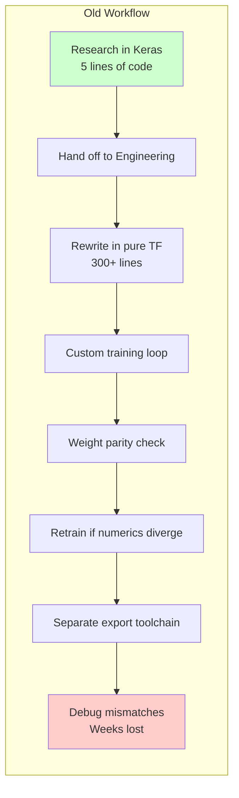
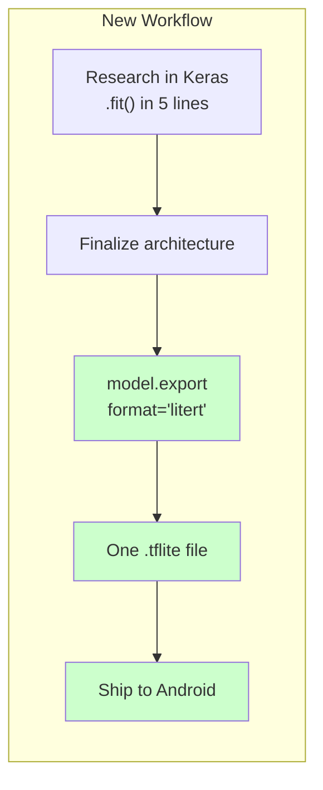
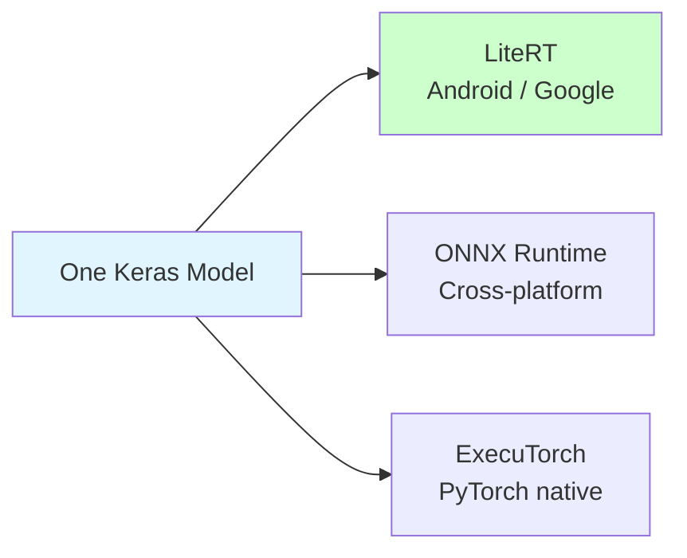
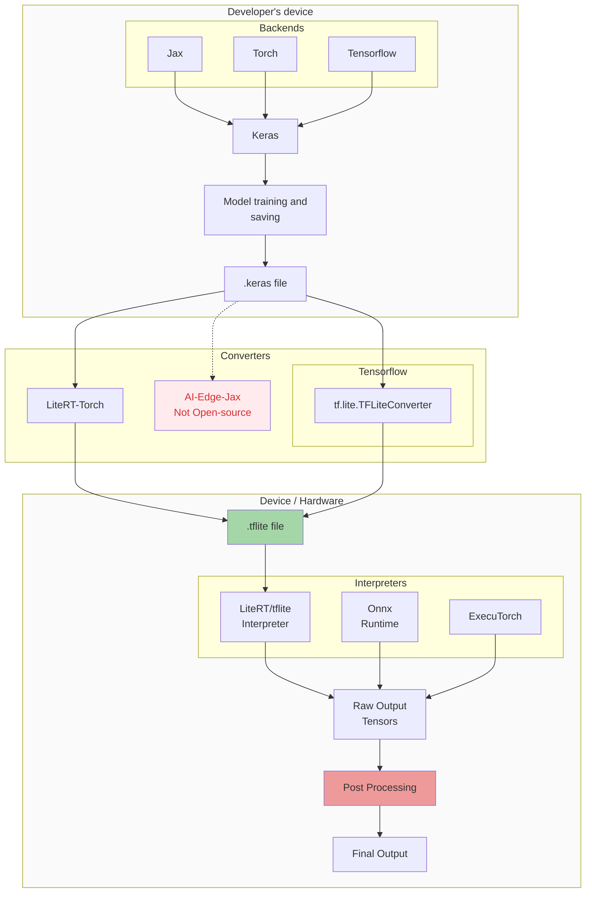
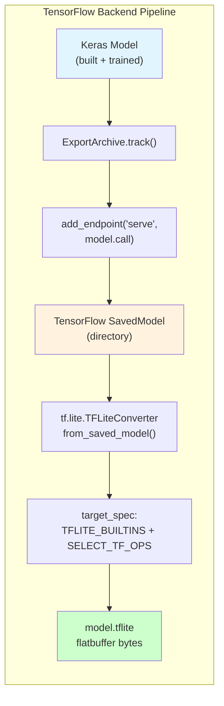
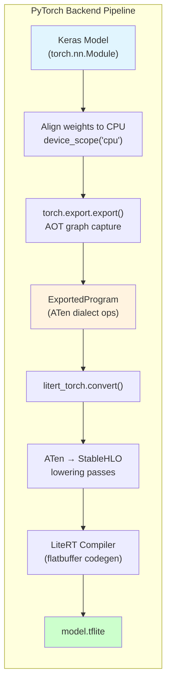
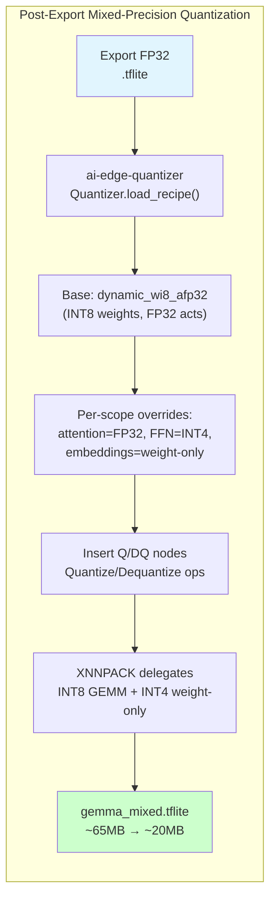
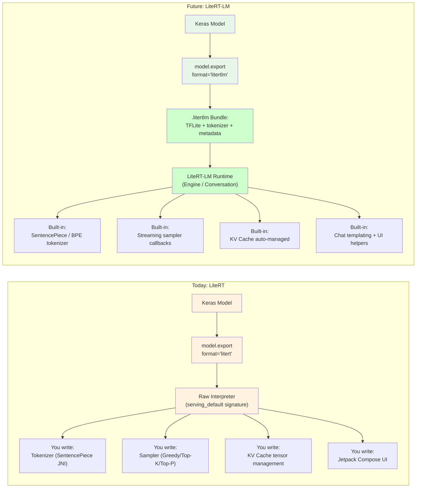
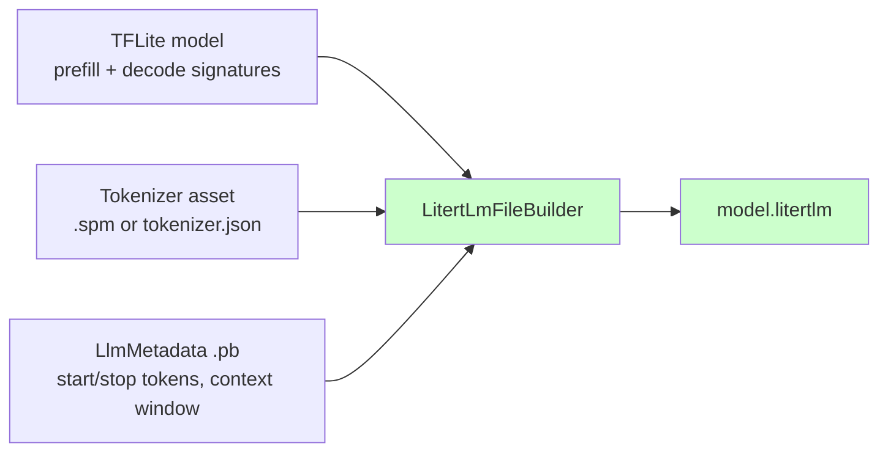

# On-Device AI with Keras — LiteRT Export Deep Dive

> Copy-paste ready slide content. Every snippet verified with `keras` master, `keras-hub` master, and `litert-torch` master.

---

## Slide 1: Title

**On-Device AI with Keras**

Supporting model export for LiteRT Runtime

---

## Slide 2: The Problem — Keras vs Pure Framework Rewrite

**Keras makes model development simple:**

```python
# Keras: 5 lines
model = keras_hub.models.Gemma3CausalLM.from_preset("gemma3_270m")
model.compile(optimizer="adam", loss="sparse_categorical_crossentropy")
model.fit(dataset, epochs=3)
model.evaluate(val_dataset)
model.save("my_model.keras")
```

**But to deploy on-device, engineering historically had to rewrite everything in pure TensorFlow:**

```python
# Pure TF: 300+ lines of custom training loop
optimizer = tf.optimizers.Adam()
train_loss = tf.keras.metrics.Mean()

def train_step(x, y):
    with tf.GradientTape() as tape:
        logits = model(x, training=True)
        loss = compute_loss(logits, y)
        # Custom masking, label smoothing, gradient clipping...
    gradients = tape.gradient(loss, model.trainable_variables)
    optimizer.apply_gradients(zip(gradients, model.trainable_variables))
    train_loss.update_state(loss)

# Then: custom checkpointing, metric logging, distributed strategy...
# Then: verify weight loading matches Keras exactly
# Then: export through a separate converter
```

Same model. Same math. **100× more code.**

---

## Slide 3: The Full Rewrite Tax

After the pure TF rewrite, the pain continues:



**Every model iteration triggered this cycle.**

Researchers tried 5 architectures, 3 datasets, tuned hyperparameters in Keras — then told engineering to rewrite the winner from scratch. Engineering re-implemented layers, re-wrote training loops, re-verified weights, and often had to retrain because floating-point ordering diverged.

---

## Slide 4: How LiteRT Export Changes Everything

**Old workflow:**


**New workflow:**



No rewrite. No custom training loop. No parity debugging.

One line. One model. One flatbuffer.

```python
model.export("model.tflite", format="litert")
```

---

## Slide 5: What is LiteRT?

LiteRT (formerly TensorFlow Lite) is Google's on-device runtime for neural network inference.

- Cross-platform: Android, iOS, Windows, Linux, Embedded, IoT
- Languages: Java, Kotlin, JavaScript, C, C++
- Format: FlatBuffer (`.tflite`) — memory-mapped for instant loading
- Quantization: INT8, FP16, INT4 weight-only
- Hardware: CPU (XNNPACK), GPU (OpenCL/Vulkan), NPU (NNAPI)

---

## Slide 6: The Runtime Landscape

Keras models need to run on diverse high-performance runtimes.



Our goal: **one Keras model → multiple optimized runtimes** with zero rewrites.

---

## Slide 7: High-Level Flow — Keras to Device

Detailed architecture matching the original PPT Slide 12/13:



---

## Slide 8: Dual-Backend Export Pipelines

Keras 3 is backend-agnostic. The export API uses different compilers depending on `KERAS_BACKEND`.

### TensorFlow Backend Pipeline



### PyTorch Backend Pipeline



---

## Slide 9: Verified Export Code — TensorFlow Backend

```python
import os
os.environ["KERAS_BACKEND"] = "tensorflow"
import keras_hub

model = keras_hub.models.Gemma3CausalLM.from_preset(
    "hf://google/gemma-3-270m-it"
)
model.preprocessor.sequence_length = 128

# Build weights via generate()
model.generate(["What is Keras?"], max_length=16)

# Export — works out of the box
model.export("gemma3_270m_tf.tflite", format="litert")
```

**Notes:**
- The TensorFlow team plans to keep `TFLiteConverter` in the ecosystem. The `Interpreter` API is what shifted to LiteRT.
- TF-backend exports include `Select TF ops` (e.g., `FlexStridedSlice`). On Android you must add `org.tensorflow:tensorflow-lite-select-tf-ops` to your dependencies. PyTorch-backend exports do not need this.

---

## Slide 10: Verified Export Code — PyTorch Backend

```python
import os
os.environ["KERAS_BACKEND"] = "torch"
import keras_hub
from keras import layers

model = keras_hub.models.Gemma3CausalLM.from_preset(
    "hf://google/gemma-3-270m-it"
)
model.preprocessor.sequence_length = 128

# Build via direct call
processed = model.preprocessor({
    "prompts": ["What is Keras?"], "responses": [""]
})
model(processed[0])

# IMPORTANT: explicitly specify input_signature for torch backend
input_signature = [{
    "token_ids": layers.InputSpec(dtype="int32", shape=(1, 128)),
    "padding_mask": layers.InputSpec(dtype="int32", shape=(1, 128)),
}]

model.export(
    "gemma3_270m_torch.tflite",
    format="litert",
    input_signature=input_signature,
)
```

**Why torch backend?**
- Cleaner graph with fewer legacy TensorFlow ops
- Future-proof as Google invests in StableHLO / AI-Edge-Torch
- We also hope to see `ai-edge-jax` open-sourced for JAX backend parity

---

## Slide 11: Quantization — Two Paths, Your Choice

The export API gives you a clean, numerically correct FP32 model. What you do next is your call.

### Path A: Quick Uniform Quantization (via `model.export` kwargs)

```python
import tensorflow as tf

model.export(
    "gemma_quantized.tflite",
    format="litert",
    optimizations=[tf.lite.Optimize.DEFAULT],  # all layers → FP16
)
```

**Best for:** Prototyping, demos, or when you want one precision everywhere.

### Path B: Mixed-Precision (via `ai-edge-quantizer`)



```python
from ai_edge_quantizer import quantizer, recipe

qt = quantizer.Quantizer("gemma_fp32.tflite")
qt.load_quantization_recipe(recipe.dynamic_wi8_afp32())

qt.update_quantization_recipe([
    {"op_type": "FULLY_CONNECTED",
     "scope": ".*attention.*",
     "algorithm_key": "no_quantize"},
    {"op_type": "FULLY_CONNECTED",
     "scope": ".*feedforward.*",
     "algorithm_key": "dynamic_wi4_afp32"},
])

qt.quantize().export_model("gemma_mixed.tflite")
```

**Best for:** Production, where you tune accuracy vs latency per component.

**Why both exist:**
A medical app and a chat demo have different accuracy budgets. A 270M model and a 4B model have different latency constraints. We give you the correct FP32 export; **choosing the quantization strategy is your domain-specific decision**.

---

## Slide 12: What You Bring — Android Application Code

LiteRT gives you a `.tflite` flatbuffer. The rest is your product.

You write:

```kotlin
// 1. Tokenizer (SentencePiece JNI)
val tokens = tokenizer.tokenize(prompt)

// 2. Build padding mask
val paddingMask = IntArray(seqLen) { if (it < tokens.size) 1 else 0 }

// 3. Run inference via Interpreter signature
interpreter.runSignature(inputs, outputs, "serving_default")

// 4. Sample next token from logits
val nextToken = sampler.getNextToken(logits)

// 5. Detokenize
val text = tokenizer.detokenize(generatedTokens)
```

**Why we don't bundle this:**
- Tokenizers vary (SentencePiece, BPE, WordPiece)
- Sampling strategies vary (Greedy for search, Top-P for creative writing)
- UI frameworks vary (Jetpack Compose, React Native, native Canvas)
- We give you the engine. You design the car.

---

## Slide 13: LiteRT vs LiteRT-LM — Clear Distinction



| | LiteRT (today) | LiteRT-LM (future) |
|---|---|---|
| Export format | `.tflite` | `.litertlm` (bundle) |
| Tokenization | You bring SentencePiece | Built-in (`.spm` or `tokenizer.json`) |
| Sampling | You write Greedy/Top-K/Top-P | Built-in samplers |
| KV Cache | Manual tensor management | Automatic |
| Chat templating | You write | Runtime applies based on model type |
| Speed | Good | Faster — fused prefill/decode kernels |
| Output quality | Good | Better — optimized attention backends |
| Ease of use | Medium | High — drop-in chat generation |
| Status | ✅ Available now | 🔄 PR #2705 — available on the `torch-backend-litert-minimal-litertlm` branch |

**Bottom line:** LiteRT export eliminates the **model rewrite tax**. LiteRT-LM will additionally eliminate the **inference boilerplate tax**.

---

## Slide 14: LiteRT-LM — What's Inside the Bundle

A `.litertlm` file is not just a `.tflite` — it's a **Task Bundle** containing three assets:



**Two signatures inside the TFLite:**

| Signature | Input tokens | Returns | Purpose |
|-----------|-------------|---------|---------|
| **prefill** | Full prompt `seq_len = N` | Updated KV caches only | Fill the cache with the prompt |
| **decode** | Single token `seq_len = 1` | Logits + updated KV caches | Auto-regressive generation |

The runtime calls `prefill` once per turn, then loops on `decode` until a stop token.

---

## Slide 15: LiteRT-LM Export API (PyTorch Backend Only)

```python
import os
os.environ["KERAS_BACKEND"] = "torch"
import keras_hub

model = keras_hub.models.Gemma3CausalLM.from_preset("gemma3_1b")

# Export as .litertlm bundle — PyTorch backend only
# Bucketing: multiple prefill signatures for efficient prompt handling
model.export(
    "model.litertlm",
    format="litertlm",
    prefill_seq_len=[32, 64, 128, 256, 512, 1024],
)
```

**Requirements:**
- `keras.config.backend() == "torch"` — JAX and TensorFlow backends are not supported
- `prefill_seq_len` is baked into the graph; pass a list for bucketing
- **Bucketing increases export time** (~1.5× for 3 buckets) because each signature is traced separately, but model size increase is minimal (~0.07% for 3 extra signatures) since weights are shared
- `quant_config` forwards to `litert_torch.convert()` for in-graph quantization
- For post-export quantization, extract TFLite → `ai-edge-quantizer` → repackage

---

## Slide 16: LiteRT-LM Android Runtime

**Single dependency:**

```kotlin
// build.gradle.kts
dependencies {
    implementation("com.google.ai.edge.litertlm:litertlm-android:0.10.0")
}
```

**Required gradle settings:**

```kotlin
android {
    defaultConfig {
        ndk { abiFilters += listOf("arm64-v8a") }
    }
    androidResources { noCompress += listOf("litertlm") }
    packaging { jniLibs { useLegacyPackaging = true } }
}
```

**Runtime code:**

```kotlin
val engine = Engine(EngineConfig(modelPath, backend = Backend.CPU()))
engine.initialize()
val conversation = engine.createConversation()
conversation.sendMessageAsync("Hello").collect { token ->
    textView.append(token)
}
```

**What the runtime handles for you:**
- Tokenizer invocation (SentencePiece or BytePair)
- Prefill/decode signature dispatch
- KV cache allocation and indexing
- Sampling (Greedy, Top-K, Top-P via `SamplerConfig`)
- Chat templating based on model type (Gemma, Qwen, Llama)
- Streaming tokens via `Flow<Message>`

---

## Slide 17: LiteRT-LM — Current Limitations

| Limitation | Detail |
|------------|--------|
| **PyTorch backend only** | `keras.config.backend() == "torch"`. JAX/TensorFlow not supported. |
| **Fixed prefill length** | `prefill_seq_len` is baked into graph, but **bucketing** (`list[int]`) lets the runtime pick the smallest fitting signature. **Measured 43% faster TTFT** on Pixel 9 for a 31-token prompt vs fixed-128. |
| **Post-export quantization** | FP32/BF16 output. Must use `ai-edge-quantizer` + repackage for deployable sizes. |
| **TFLite 2 GB limit** | Models >~2B params in FP32 exceed FlatBuffer. Must use INT8/INT4. |
| **Emulator unsupported** | Fails on x86_64 emulators. Physical ARM64 devices required. |
| **CPU-only validated** | `Backend.CPU()` works. GPU/NPU delegates exist but untested. |
| **No APK bundling** | Models 275 MB–1 GB+, exceeding Play Store limits. Must push/download at runtime. |
| **First-load latency** | Engine initialization compiles graph on first run (~1–5s on Pixel 9). |
| **Chat template baked** | Developers control content (roles, history) but not the template string. |

---

## Slide 18: LiteRT-LM Before vs After

**Before (raw LiteRT):**

```kotlin
// 200+ lines of InferenceEngine.kt
// Manual tokenization, padding mask, logits sampling,
// KV cache tensor management, signature dispatch
```

**After (LiteRT-LM):**

```kotlin
// ~10 lines
val engine = Engine(EngineConfig(modelPath, backend = Backend.CPU()))
engine.initialize()
val conversation = engine.createConversation()
conversation.sendMessageAsync("What is Keras?")
    .collect { token -> textView.append(token) }
```

---

## Slide 19: Upcoming Challenges & Opportunities

| Item | Status | Path Forward |
|------|--------|--------------|
| `tf.lite.TFLiteConverter` | Staying | TF team confirmed converter remains |
| `tf.lite.Interpreter` | Moved to `ai_edge_litert` | New LiteRT package |
| Torch backend | Available now | `litert_torch` + StableHLO |
| JAX backend | Not yet open sourced | Hope to see `ai-edge-jax` released |
| Mixed-precision in export | User's choice post-export | Use `ai-edge-quantizer` for now |
| LiteRT-LM | PR #2705 (draft) | PyTorch-only, prefill/decode signatures, bundle format |

---

## Slide 20: Production Checklist

- [ ] Choose backend: **TensorFlow** (proven) or **PyTorch** (explicit `input_signature`)
- [ ] Export FP32 `.tflite` and verify with `ai_edge_litert.interpreter.Interpreter`
- [ ] For quick uniform quantization: pass `optimizations=[tf.lite.Optimize.DEFAULT]`
- [ ] For mixed-precision: run `ai-edge-quantizer` with your own component-scoped recipes
- [ ] Write Android code for: tokenizer, padding mask, sampler, detokenizer, UI
- [ ] For LiteRT-LM: ensure PyTorch backend, export `.litertlm`, test on physical ARM64 device
- [ ] Evaluate **LiteRT-LM** when PR #2705 lands — eliminates InferenceEngine boilerplate

---

## Slide 21: References

| Repository | Role |
|-----------|------|
| `keras-team/keras` | Export logic (`keras/src/export/litert.py`) |
| `keras-team/keras-hub` | Gemma presets, tokenizers, multimodal export tests |
| `keras-team/keras-hub/pull/2705` | **LiteRT-LM export PR** — prefill/decode signatures, `.litertlm` bundle (branch: `torch-backend-litert-minimal-litertlm`) |
| `google-ai-edge/litert-torch` | PyTorch → LiteRT conversion stack |
| `google-ai-edge/ai-edge-quantizer` | Post-training mixed-precision quantization |
| `pctablet505/gemmademo-android-app` | Android demo using raw Interpreter |
| `pctablet505/gemmademo-litertlm-android-app` | Android demo using LiteRT-LM runtime |
| `pctablet505/litert-demo` | **This repo** — slides + verified export notebooks |

---

## Slide 22: Thank You

**Questions?**

*Verified companion notebooks:*
- `litert_export_demo.ipynb` — LiteRT (`.tflite`) export from TF & PyTorch backends
- `litertlm_export_demo.ipynb` — LiteRT-LM (`.litertlm`) bundle export

*Landscape diagram PNG exports available in `/content/mermaid_diagrams/`*
