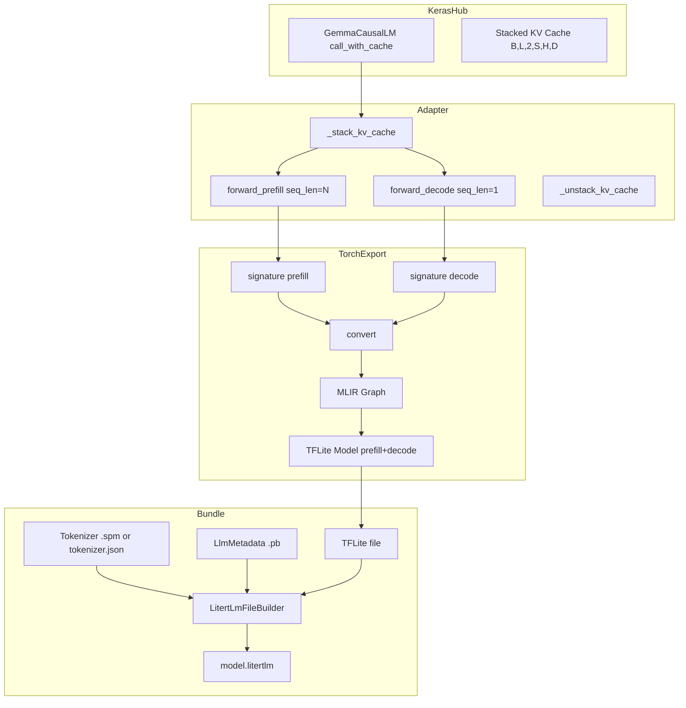
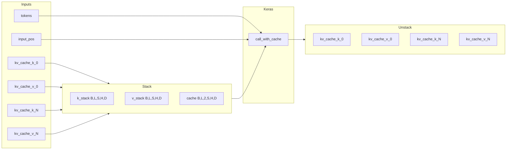
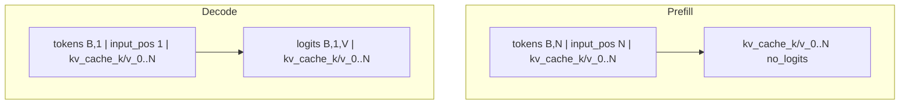
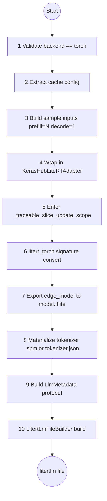
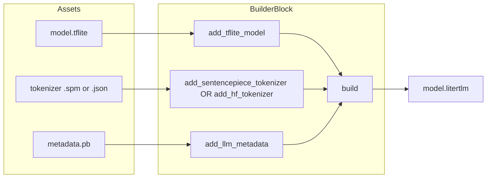

# Design Doc: KerasHub → LiteRT-LM Export

## 1. Goal

Enable `CausalLM.export(filepath, format="litertlm")` to produce a complete `.litertlm` Task Bundle that the LiteRT-LM on-device runtime can load and execute without any hand-written native inference code.

## 2. Background

Keras supports `model.export(format="litert")`, which produces a raw `.tflite` inference graph with a single `serving_default` signature. The developer must then write native code for:
- TFLite interpreter loading and buffer management
- KV-cache allocation and indexing
- Tokenizer bundling and invocation
- Prefill/decode splitting
- Sampling loop and stop-token detection

This is ~200+ lines of model-specific code per architecture. There is no native path from KerasHub to the `.litertlm` bundle format that encapsulates all of this.

## 3. Proposed Design

### 3.1 User-Facing API

**Python (export):**
```python
model = keras_hub.models.Gemma3CausalLM.from_preset("gemma3_1b")
model.export("model.litertlm", format="litertlm", prefill_seq_len=128)
```

**Bucketing:** `prefill_seq_len` accepts a single `int` or a `list[int]`. When a list is provided, the exporter traces one prefill signature per bucket. At runtime the LiteRT-LM executor dispatches to the smallest bucket that fits the actual prompt, avoiding wasted computation on padding.

```python
model.export(
    "model.litertlm",
    format="litertlm",
    prefill_seq_len=[32, 64, 128],
)
```

**Android (runtime):**
```kotlin
// build.gradle.kts
dependencies {
    implementation("com.google.ai.edge.litertlm:litertlm-android:0.10.0")
}

// Kotlin
val engine = Engine(EngineConfig(modelPath, backend = Backend.CPU()))
engine.initialize()
val conversation = engine.createConversation()
conversation.sendMessageAsync("Hello").collect { print(it) }
```

### 3.2 What the `.litertlm` bundle contains

1. **TFLite model** with `prefill` and `decode` signatures (one `prefill` signature per bucket when bucketing is used)
2. **Tokenizer asset** — SentencePiece `.model` or HuggingFace `tokenizer.json`
3. **LlmMetadata protobuf** — start/stop tokens, model type, context window

## 4. Architecture

### 4.1 High-Level Flow



### 4.2 The Adapter

KerasHub uses a **stacked KV cache**: `[batch, num_layers, 2, ...]` and a scalar `cache_update_index`.
LiteRT-LM expects **flat per-layer tensors**: `kv_cache_k_0`, `kv_cache_v_0`, … and a 1-D `input_pos` tensor.

`KerasHubLiteRTAdapter` (PyTorch `nn.Module`) performs the translation:



Two cache layouts are supported:
- `clhd` (default): `[batch, cache_length, num_kv_heads, head_dim]` — Gemma3, Llama, Mistral, etc.
- `lchd` (Gemma3n): `[batch, num_kv_heads, cache_length, head_dim]`

### 4.3 Why two signatures?



| Signature | Input tokens | Returns | Purpose |
|-----------|-------------|---------|---------|
| **prefill** | Full prompt `seq_len = N` | Updated KV caches only | Fill the cache with the prompt |
| **decode** | Single token `seq_len = 1` | Logits + updated KV caches | Auto-regressive generation |

The runtime calls `prefill` once per turn, then repeatedly calls `decode` until a stop token is hit.

**Bucketing:** When `prefill_seq_len=[32, 64, 128]` is passed, the exporter traces three prefill signatures (`prefill_32`, `prefill_64`, `prefill_128`) plus one decode signature. The runtime selects the smallest bucket ≥ the actual prompt length, eliminating wasted compute on padding.

### 4.4 Export Pipeline



**Step 5: The `slice_update` monkey-patch**

Keras `ops.slice_update` converts tensor start-indices to Python ints via `.tolist()`. This fails during `torch.export.export` when the index is dynamic (e.g. the decode position `input_pos`).

`_traceable_slice_update_scope()` (context manager in `adapter.py`) temporarily replaces the Keras torch-backend implementation with one that uses `torch.index_copy_` for dynamic indices and direct slice assignment for static ones.

### 4.5 Bundle Packaging



## 5. Key Components

| File | Role |
|------|------|
| `adapter.py` | PyTorch `nn.Module` adapter. Translates between KerasHub stacked KV cache and LiteRT-LM flat tensors. Includes `_traceable_slice_update_scope()` for dynamic index traceability. |
| `export.py` | Main pipeline. Validates backend, extracts config, builds sample inputs, traces signatures, materializes tokenizer, builds metadata, packages bundle. |
| `export_test.py` | Integration tests: end-to-end export + numerical correctness (`atol=1e-4` against eager Keras outputs). |
| `causal_lm.py` | One-line dispatch: `CausalLM.export()` routes to `export_to_litertlm()` when `format="litertlm"`. |

## 6. Tokenizer Support

| Model family | KerasHub tokenizer | Builder method | Asset |
|--------------|-------------------|----------------|-------|
| Gemma, Mistral, Phi3 | `SentencePieceTokenizer` | `add_sentencepiece_tokenizer()` | `vocabulary.spm` |
| Llama3, Qwen3, GPT-2, SmolLM3 | `BytePairTokenizer` | `add_hf_tokenizer()` | `tokenizer.json` |

BytePair tokenizers work because KerasHub wraps HuggingFace `tokenizers.Tokenizer` internally (`tokenizer._tokenizer`). We call `.save("tokenizer.json")` to produce the exact format the runtime expects.

## 7. Metadata

The `LlmMetadata` protobuf stores:

| Field | Source | Purpose |
|-------|--------|---------|
| `start_token` | `tokenizer.start_token_id` | Token that begins generation |
| `stop_tokens` | `tokenizer.end_token_id` + `<end_of_turn>` (if present) | Tokens that terminate generation |
| `max_num_tokens` | `model.preprocessor.sequence_length` | Context window size |
| `llm_model_type` | Model class name → enum | Tells runtime which chat template to apply |

Model type mapping:
- `Gemma3CausalLM` → `gemma3`
- `Gemma3nCausalLM` → `gemma3n`
- `Gemma4CausalLM` → `gemma4`
- `Qwen3CausalLM` → `qwen3`
- `Qwen2*CausalLM` → `qwen2p5`
- everything else → `generic_model`

## 8. Quantization Strategy

### 8.1 In-Conversion Quantization (Recommended)

`CausalLM.export()` accepts an optional `quant_config` keyword argument that is forwarded directly to `litert_torch.convert()` for in-graph quantization.

Supported recipes (from `litert_torch.generative.quantize.quant_recipes`):

| Recipe | Description | Size vs FP32 |
|--------|-------------|-------------|
| `full_dynamic_recipe()` | Dynamic-range quantization of weights (activations stay FP32) | ~4× smaller |
| `full_weight_only_recipe()` | Weight-only quantization; activations remain FP32 | ~4× (INT8) – ~8× (INT4) |
| `full_fp16_recipe()` | FP16 weights and activations | ~2× smaller |

Each recipe accepts `weight_dtype` (`INT8`, `INT4`, `FP16`, `FP32`) and `granularity` (`CHANNELWISE`, `BLOCKWISE_32`, `BLOCKWISE_64`, `BLOCKWISE_128`, `BLOCKWISE_256`).

Example:
```python
from litert_torch.generative.quantize.quant_recipes import full_dynamic_recipe

model.export(
    "model.litertlm",
    format="litertlm",
    prefill_seq_len=128,
    quant_config=full_dynamic_recipe(),
)
```

### 8.2 Post-Export Quantization

If `quant_config` is omitted, export produces unquantized FP32/BF16. For deployable sizes:

1. Export to `.litertlm`
2. Extract TFLite from bundle
3. Run `ai-edge-quantizer` (supports INT8, INT4, dynamic/static, weight-only)
4. Repackage with `LitertLmFileBuilder`

Example: Gemma3 270M goes from ~1.1 GB (FP32) → ~275 MB (INT8 dynamic).

## 9. Testing Strategy

| Test | What it verifies |
|------|-----------------|
| `test_export_tiny_gemma` | End-to-end export produces a valid `.litertlm` file |
| `test_export_with_bucketing` | Passing a list of `prefill_seq_len` creates multiple prefill signatures (`prefill_4`, `prefill_8`, …) plus decode |
| `test_export_outputs_match_keras` | TFLite prefill/decode outputs match eager Keras/PyTorch within `1e-4` |

All tests skip when `keras.config.backend() != "torch"`.

## 10. Performance

### 10.1 On-Device TTFT (Time-To-First-Token)

Measured on a **Pixel 9** with Gemma3 270M:

| Prefill length | Single bucket (pad to max) | Buckets `[32, 64, 128]` | Improvement |
|----------------|---------------------------|------------------------|-------------|
| 32 tokens | ~43 ms | ~31 ms | **~28%** |
| 64 tokens | ~61 ms | ~35 ms | **~43%** |

Bucketing eliminates wasted computation on padding by dispatching to the smallest signature that fits the prompt. TTFT is **up to 43% faster** for short prompts when bucketing is enabled.

### 10.2 Export Time

| Configuration | Wall time (workstation, Gemma3 270M) |
|---------------|--------------------------------------|
| Single `prefill_seq_len=128` | ~6–8 minutes |
| Bucketed `[32, 64, 128]` | ~10–11 minutes |

Each additional prefill bucket requires an extra `torch.export` trace. Decode is traced once regardless of bucket count.

## 11. Limitations

### Export-Time

| Limitation | Detail |
|------------|--------|
| PyTorch backend only | `keras.config.backend() == "torch"`. JAX/TensorFlow not supported. |
| Fixed prefill length per signature | Each prefill signature bakes one length into the graph. **Bucketing (`prefill_seq_len: list[int]`) mitigates this** by providing multiple signatures; the runtime selects the smallest bucket that fits the prompt. |
| TFLite 2 GB limit | Models >~2B params in FP32 exceed FlatBuffer limit. Must use INT8/INT4. |
| Architecture coverage | Standard KV-cache transformers only. RWKV incompatible. |

### Runtime (LiteRT-LM)

| Limitation | Detail |
|------------|--------|
| Emulator unsupported | Fails on x86_64 emulators. Physical ARM64 devices required. |
| CPU-only validated | `Backend.CPU()` works. GPU/NPU delegates exist but untested. |
| No APK asset bundling | Models 275 MB–1 GB+, exceeding Play Store limits. Must push/download at runtime. |
| Chat template format baked | Developers control content (roles, system prompt, history) but not the template formatting string. Runtime applies it based on `LlmModelType`. |
| First-load latency | Engine initialization compiles TFLite graph on first run (~1–5s on Pixel 9). |

### Multimodal

LiteRT-LM supports multimodal (vision + audio) via `Content.ImageBytes`, `Content.AudioBytes`, and `InputData.Image/Audio`. The `.litertlm` bundle can contain multiple TFLite models (`PREFILL_DECODE`, `VISION_ENCODER`, `AUDIO_ENCODER`). Our export currently handles text-only; multimodal requires exporting vision/audio encoders separately and packaging them into the same bundle.

## 12. Device Deployment

### 12.1 Android Dependency

Only one runtime library is required:

```kotlin
// build.gradle.kts
dependencies {
    implementation("com.google.ai.edge.litertlm:litertlm-android:0.10.0")
}
```

`litertlm-android` pulls in the native TFLite runtime, delegates, and JNI bindings. No Keras, PyTorch, or HuggingFace libraries are needed on the device.

### 12.2 Required build.gradle.kts Settings

```kotlin
android {
    defaultConfig {
        ndk { abiFilters += listOf("arm64-v8a") }
    }
    androidResources { noCompress += listOf("litertlm") }
    packaging { jniLibs { useLegacyPackaging = true } }
}
```

- `abiFilters`: LiteRT-LM native libraries ship only for `arm64-v8a`
- `noCompress`: Prevents Android from compressing `.litertlm` files (they are memory-mapped at runtime)
- `useLegacyPackaging`: Required for 16 KB page size support on newer Android devices

### 12.3 Model Delivery

Models are 275 MB–1 GB+, far exceeding Play Store APK asset limits (~100 MB). They **cannot** be bundled as `src/main/assets`. Two delivery patterns:

1. **Push to device storage** (development / CI):
   ```bash
   adb push model.litertlm /data/local/tmp/
   ```
   The app reads from the filesystem path directly.

2. **Download at runtime** (production):
   Download the `.litertlm` to `context.getExternalFilesDir(null)` or `context.filesDir` on first launch.

`EngineConfig.modelPath` must be an absolute filesystem path. It does not support `asset://` or `content://` URIs.

### 12.4 Backend Configuration

```kotlin
val config = EngineConfig(
    modelPath = modelFile.absolutePath,
    backend = Backend.CPU(),
    cacheDir = context.cacheDir.absolutePath
)
```

- `Backend.CPU()` — validated on physical ARM64 devices
- `Backend.GPU()` / `Backend.NPU()` — exist in the API but are not yet validated across models
- `visionBackend` / `audioBackend` — separate backends for multimodal encoder models

### 12.5 Runtime Behavior

| Behavior | Detail |
|----------|--------|
| **First-load latency** | Engine initialization compiles the TFLite graph on first run (~1–5 seconds on a Pixel 9). Warm up in a background coroutine before the first user interaction. |
| **Sampling control** | `SamplerConfig(topK, topP, temperature, seed)` can be passed per-`Conversation` via `ConversationConfig`. |
| **Chat templating** | The runtime applies templates internally based on `LlmModelType`. Developers control content (system prompt, message history, roles) but cannot customize the template formatting string. |
| **Streaming** | `sendMessageAsync()` returns a `Flow<Message>` that emits tokens as they are generated. |
| **Emulator** | The LiteRT-LM runtime fails on x86_64 emulators with delegate errors. Physical ARM64 devices are required for testing and deployment. |

## 13. Alternatives Considered

| Alternative | Why Not Sufficient |
|-------------|-------------------|
| Status quo (`format="litert"` only) | Forces developers to hand-write ~200+ lines of native inference code per model. |
| Export raw TFLite only | Still leaves tokenization, cache management, and chat templating unsolved. |
| Build a Keras-specific mobile SDK | Would fragment the Google AI Edge stack. LiteRT-LM already powers Gemini Nano on Pixel. |
